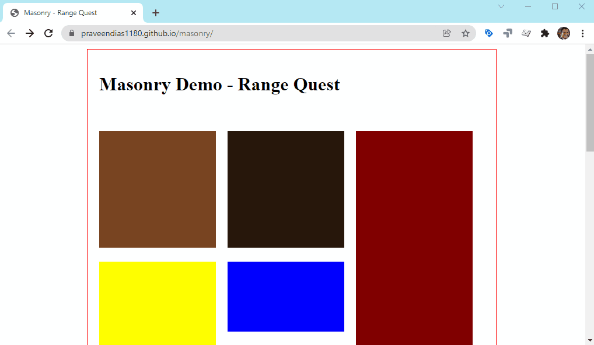

# Masonry

https://github.com/desandro/masonry

[Visit DEMO](https://praveendias1180.github.io/masonry/)

### Cascading grid layout library

Masonry works by placing elements in optimal position based on available vertical space, sort of like a mason fitting stones in a wall. You’ve probably seen it in use all over the Internet.

# Horizontal Tiles

## Flex-grow

# Infinite Scroll

[EXPERIENCE Infinite Scroll](https://praveendias1180.github.io/masonry/)